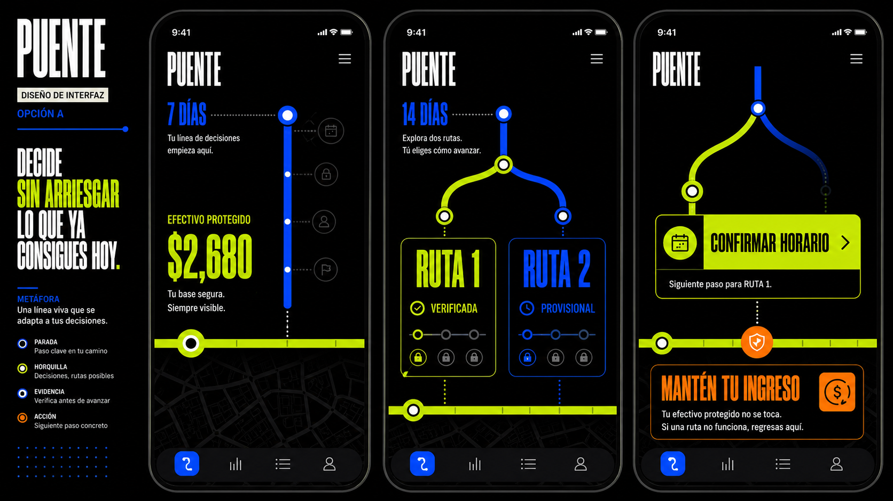
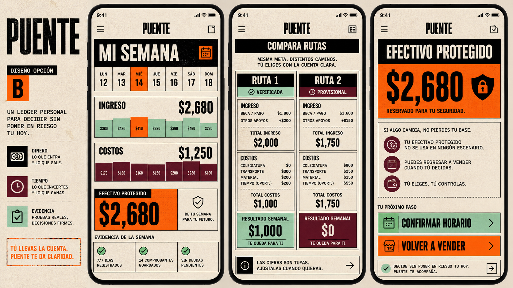
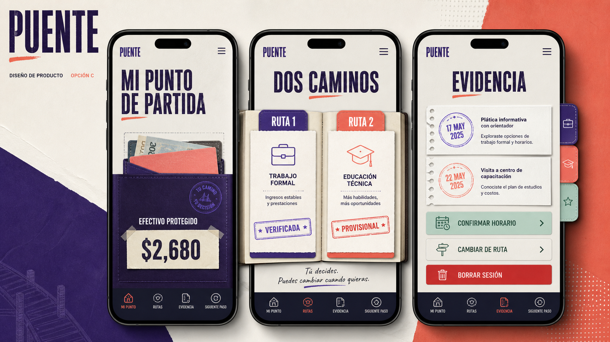

# Puente - Design Options and Critical Decisions Review

**Purpose:** choose the product direction before code and challenge every assumption that could change the prototype.  
**Decision labels:** `TEAM` comes from the Team 6 Blueprint; `SLICE` is Rodrigo's current product decision and can be changed before implementation; `HYPOTHESIS` requires testing; `SECURITY` should not be weakened without a safer replacement.

## Design option A - Living Route

**Metaphor:** the decision is a transit line. Evidence is a stop, uncertainty is a fork, and the protected-cash level remains visible as the user moves through routes.

**Why it feels like a startup:** it has a proprietary visual behavior rather than a collection of dashboard cards. The route line can become Puente's product signature across onboarding, comparison, action, and fallback.

**Strengths:** memorable; visually innovative; explains movement and reversibility; creates a strong three-minute demo; makes route branches equal.  
**Risks:** black background and condensed type can reduce readability; a route map may imply that all paths are already connected or verified; more difficult to implement accessibly.  
**Best use:** strongest external brand and demo direction.

## Design option B - Survival Ledger

**Metaphor:** Puente is the user's personal operating ledger. Every peso, hour, cost, and missing proof is visible before a route is accepted.

**Why it feels like a startup:** the information architecture is built around a category-specific object - the cash-protection ledger - rather than a generic career dashboard. It is bold, utilitarian, and auditable.

**Strengths:** communicates opportunity cost best; transparent arithmetic; fits the user's distrust of hidden calculations; easiest direction for a working responsive prototype.  
**Risks:** neo-brutalism can feel severe or institutional; dense screens need progressive disclosure; it may overemphasize money and underrepresent aspiration.  
**Best use:** strongest product and usability foundation.

## Design option C - Open Passport

**Metaphor:** routes are removable pages owned by the user. Evidence is dated, routes can be changed, and the session can be erased.

**Why it feels like a startup:** it creates a tactile, editorial identity around portable evidence and user ownership rather than a conventional app dashboard.

**Strengths:** strongest expression of dignity, evidence ownership, and open future; visually warm and aspirational; excellent for showing formal-work and education routes together.  
**Risks:** passport imagery may trigger associations with government documents, migration, or credentials the user lacks; decorative paper layers may distract from the cash calculation; stamps can look like official certification.  
**Best use:** strongest narrative and agency direction, but only after testing the metaphor.

## My recommendation before user testing

Build a **B+A hybrid**: use Option B's legible ledger and transparent arithmetic as the core screen, then use Option A's living route line as the navigation and product signature. Do not use the passport metaphor in V1 unless the synthetic persona understands it without assuming government approval. This hybrid is distinctive enough for a startup demo while remaining credible for a user who reads slowly, protects daily cash, and distrusts hidden systems.

**Final choice, September 2, 2026:** Rodrigo selected the B+A hybrid. The implementation uses Survival Ledger arithmetic and Living Route navigation with a locked black/neutral-gray/warm-ivory/acid-yellow palette. Blue was explicitly removed. `PUENTE` is the visible name, `by TRAJECTORY` is the endorsement, and the original two-span bridge/route mark becomes the product signature. The first generic mockup remains only a discarded baseline.

## Critical decisions - product identity and ownership

| ID | Label | Current decision | Why it exists | What could change |
|---|---|---|---|---|
| P1 | TEAM | The team's product is **Trajectory**, a verified, user-controlled, cash-protected navigator for employment and educational re-entry. | This is the primary vacuum chosen in the Blueprint. | Only Team 6 should change the primary product. |
| P2 | SLICE | **Puente** is Rodrigo's user-facing slice or module inside Trajectory. | Preserves the work already developed without contradicting the team name. | Puente could become the full product name if the team agrees. |
| P3 | TEAM | Proof-of-Skill remains evidence inside a route, not the primary product. | Preserves Andrea's contribution without creating a separate product. | The amount of proof-of-skill functionality remains open. |
| P4 | TEAM | The state employment service pays; the applicant pays nothing. | Avoids charging the financially constrained user and gives an accountable operator. | A nonprofit could be the first payer if the team approves. |
| P5 | TEAM | Start with one state office and a limited partner network, not a national platform. | Live route data require maintenance and accountable handoffs. | Exact office and partners are not selected. |
| P6 | SLICE | V1 is a decision-and-safety layer, not a career coach or job marketplace. | Keeps the build small and testable. | A later version may connect to a maintained opportunity network. |

## Critical decisions - exact user and failed moment

| ID | Label | Current decision | Why it exists | What could change |
|---|---|---|---|---|
| U1 | SLICE | One exact user: a 20-year-old man in Ecatepec de Morelos who left high school to help financially at home and sells packaged candy on foot near a Mexibus route. | Avoids designing for all informal workers. | Age, gender, municipality, route, and product sold are all adjustable before testing. |
| U2 | SLICE | The invented testing name is **Luis** and all data are synthetic. | Protects privacy and satisfies the security floor. | Name can change; real-person data must not enter the demo. |
| U3 | HYPOTHESIS | His formal-work attempt was an entry-level McDonald's application after reading the guide and attending an interview. | Gives the journey one concrete failed moment. | Employer can be generalized if using the brand creates distraction. |
| U4 | HYPOTHESIS | The immediate failure is schedule and cash-flow incompatibility; incomplete high school is a causal barrier only if the employer documents it. | Replaces the stigmatizing claim that the person "looked unstable." | Needs real recruiter or vacancy evidence. We should not invent the rejection reason. |
| U5 | SLICE | "Unstable" describes informal income, not personality, reliability, intelligence, or potential. | Prevents a temporary circumstance from becoming an identity label. | This should remain unless replaced by stronger non-stigmatizing language. |
| U6 | HYPOTHESIS | The user has a low-cost Android phone, reads slowly, and distrusts debt-like or government-scoring interfaces. | Creates a realistic accessibility test. | Must be validated; it is not a fact about all informal workers. |

## Critical decisions - cash and opportunity cost

| ID | Label | Current decision | Why it exists | What could change |
|---|---|---|---|---|
| C1 | HYPOTHESIS | Formal income is modeled around MXN 9,500 per month. | Reflects the planning assumption discussed in the Brain session. | Replace with the actual written offer; never present as guaranteed salary. |
| C2 | HYPOTHESIS | Candy sales currently protect approximately MXN 1,200 net per week. | Creates a concrete immediate-income floor. | Must come from a real seven-day log; this number is not a population average. |
| C3 | SLICE | The 14-day floor is MXN 2,400 because many formal jobs pay biweekly. | Protects the household until the first expected paycheck. | Could be 7, 14, or more days based on actual payment timing. |
| C4 | SLICE | Emergency reserve equals the lowest net candy-selling day in the seven-day record. | Adds a buffer tied to observed income rather than an arbitrary amount. | Could use another conservative statistic after testing. |
| C5 | SLICE | Do not automatically eliminate 12 weekly candy-selling hours. Measure the exact hours displaced by the new route. | Captures true opportunity cost instead of imposing a generic schedule cut. | The user may choose a maximum acceptable reduction after seeing the math. |
| C6 | SLICE | Candy sales are a transition bridge until the first formal paycheck and an optional supplement afterward, not a mandatory permanent second job. | Avoids normalizing two jobs as the price of formality. | The user may voluntarily retain profitable selling windows. |
| C7 | SLICE | The verification budget is dynamic: conservative 14-day net income minus the floor and reserve. If it is zero or negative, only free verification channels are allowed. | Prevents the product from creating a new cash gap while checking a route. | Formula can change if it remains transparent and safety-preserving. |
| C8 | TEAM | Route costs include income timing, transport, equipment, schedule, first-payment date, and emergency reserve. | This is Blueprint Condition 4. | Cannot remove a category; more real costs may be added. |
| C9 | SLICE | Additional costs include phone/data, lost selling income, documents/photos, uniform or shoes, meals, onboarding, bank fees, and unpaid training. | Makes the comparison economically honest. | Keep only categories relevant to each route, but disclose omissions. |
| C10 | SECURITY | Any mandatory recruitment fee is a red flag; Puente does not recommend paying it. | Protects against fraud and exploitative hiring. | Should not be weakened. |

## Critical decisions - route and evidence logic

| ID | Label | Current decision | Why it exists | What could change |
|---|---|---|---|---|
| R1 | TEAM | Show up to three explainable routes without fabricating alternatives. | Blueprint rule. | Rodrigo's slice currently shows two; adding a third is optional. |
| R2 | SLICE | The slice uses two horizons: immediate income-preserving formal work and longer-term educational or skills advancement. | Creates meaningful alternatives rather than two similar employers. | Route categories can change if both remain feasible and distinct. |
| R3 | TEAM | Route statuses are `VERIFIED`, `PROVISIONAL`, or `UNAVAILABLE`. | Makes uncertainty visible. | Labels may be rewritten in simpler Spanish but must preserve meaning. |
| R4 | TEAM | Every route displays source, evidence date, real costs, requirements, status, and responsible institution or employer. | Maintained evidence is the binding constraint. | Fields should not be removed. |
| R5 | SLICE | Employer pay, schedule, and vacancy evidence expire after seven days; provider information expires after 30 days. | Prevents stale data from silently becoming a recommendation. | Time windows are assumptions to test with real update cycles. |
| R6 | SLICE | A formal-work route needs written employer identity, role, salary, schedule, start date, pay frequency, first-payment date, and no-fee confirmation before start. | Separates a prospect from a usable route. | Evidence list can expand; removing fields increases risk. |
| R7 | SLICE | A longer-term credential route appears only if the credential maps to at least three current comparable vacancies or direct employer confirmations. | Prevents selling education with no visible employment connection. | The threshold of three is a test assumption. |
| R8 | SLICE | The provider path also needs named provider, full cost and payment timing, schedule, completion timeline, and cash-floor compatibility. | Makes education subject to the same feasibility discipline as work. | Fields can expand but should not be hidden. |
| R9 | TEAM | No route may be called "best"; alternatives satisfying user-defined constraints receive equal visual weight. | Preserves Yonathan's dissent and the Open-Future firewall. | Should not be changed individually. |
| R10 | SLICE | If only one route is feasible, show one verified route and one provisional route or only the verified route; never invent a second feasible option. | Honesty is more important than interface symmetry. | Presentation can change; truthfulness cannot. |

## Critical decisions - formality, failure, and fallback

| ID | Label | Current decision | Why it exists | What could change |
|---|---|---|---|---|
| F1 | SLICE | Before payroll and social-security confirmation, label the opportunity **formal-employment prospect**, not completed formal re-entry. | Written promises are not completed outcomes. | Label can be simplified but should not overclaim. |
| F2 | SLICE | Count formalization only after correct payroll is received and IMSS registration can be confirmed. | Measures a real completed transition. | The confirmation mechanism remains open. |
| F3 | SLICE | If correct pay arrives but IMSS is pending, allow up to five business days only with a written commitment, correction date, and user consent. | Creates a bounded exception rather than silent tolerance. | Five days is a product rule to review, not a stated legal grace period. |
| F4 | SECURITY | No payment, off-books payment, new fee, missing written commitment, or missed correction date activates a protected exit. | Avoids escalating commitment to an unsafe route. | Should only change with stronger protection. |
| F5 | SLICE | Within 24 hours of failure, preserve or restart the existing candy route for seven days without new debt or investment while searching in parallel. | Restores the known cash mechanism quickly. | Timing and feasibility require persona testing. |
| F6 | SLICE | If the candy route cannot produce one conservative day, the next fallback is a free public employment channel with one specific no-fee contact. | Provides a fallback without selling training or requiring money. | Exact public service and geography are open. |

## Critical decisions - AI and decision architecture

| ID | Label | Current decision | Why it exists | What could change |
|---|---|---|---|---|
| A1 | TEAM | AI may assist intake, summaries, explanations, and drafts; deterministic rules and authorized humans verify eligibility, cash safety, institutional decisions, and handoffs. | Prevents persuasive text from becoming an official decision. | Team-level architecture. |
| A2 | SLICE | The Week 4 build uses a deterministic TypeScript calculator plus structured JSON route fixtures. | Makes the safety result inspectable and testable. | Technology can change if logic remains deterministic and visible. |
| A3 | SLICE | AI output is simulated in V1 and visibly labeled `SIMULATED AI OUTPUT`. | Meets the allowed stack floor without exposing an API key or personal data. | A real LLM can be added later with consent and confirmation. |
| A4 | SECURITY | Only user-confirmed facts enter the decision core. AI interpretation remains editable and cannot set a negative trait or route status. | Prevents inference from becoming identity. | Should not be weakened. |
| A5 | SECURITY | AI cannot infer employability, personality, rejection cause, ability, or potential from writing, device, neighborhood, family status, or time away. | These are unsafe proxy judgments. | Should not be weakened. |

## Critical decisions - privacy, agency, and the shadow

| ID | Label | Current decision | Why it exists | What could change |
|---|---|---|---|---|
| S1 | TEAM | No destiny score, employability score, hidden ranking, admission decision, hiring decision, or lifetime-success prediction. | Core shadow condition. | Team-level non-negotiable. |
| S2 | TEAM | Preferred path remains visible; viable alternatives get equal visual weight; assumptions are exposed; the user may change priorities, reject all routes, and erase the session. | Open-Future firewall. | Interface can change, rights cannot. |
| S3 | TEAM | No institution may use the output against the user. | Prevents a support tool from becoming a screening tool. | Requires future contractual and technical enforcement. |
| S4 | SLICE | V1 stores and transmits no personal data; refresh clears the session. | Avoids auth and RLS needs in a short public prototype. | Persistence requires authentication, RLS, retention, and deletion controls. |
| S5 | SECURITY | Do not collect exact address or routes, CURP, NSS, IDs, passwords, bank/card data, biometrics, full family identities, medical/immigration documents, or full private employer messages. | Data minimization. | Only add a field after proving it is necessary and protected. |
| S6 | SLICE | Transport uses user-reported time/cost ranges and one optional low-cost real-trip check; no map service in V1. | Avoids exact-location collection and integration scope. | A privacy-preserving transit tool could be tested later. |
| S7 | SLICE | External outreach contains only job-specific questions; the user previews and copies the draft, and Puente never sends it. | Maintains consent and reduces disclosure. | Real sending requires explicit per-message authorization. |
| S8 | SLICE | A payer receives only de-identified aggregate patterns, with broad bands and minimum cell size k=10; no raw profiles or exact locations. | Prevents subsidy from becoming surveillance. | Analytics design needs expert review before a real pilot. |
| S9 | SLICE | The user can correct, omit, export, delete, and revoke Puente data; the interface distinguishes data still in Puente from messages already sent elsewhere. | Makes control honest. | In V1 only reset/export are implemented because nothing is sent. |

## Critical decisions - pilot and operations

| ID | Label | Current decision | Why it exists | What could change |
|---|---|---|---|---|
| O1 | SLICE | User burden in the first seven days is about 30 minutes: 10-minute setup, no more than two minutes per daily log, and no more than five minutes for one contact. | Keeps data collection compatible with unstable work. | Must be measured in testing. |
| O2 | SLICE | Advisor time is capped at 30 minutes per participant across 14 days. | Tests whether a public/nonprofit operator can afford the service. | It is a pilot assumption, not a universal staffing claim. |
| O3 | SLICE | The cap includes research, messages, route entry, calculations, evidence review, re-verification, follow-up, handoff, discarded routes, and rework. | Prevents hidden labor from making the product appear scalable. | Categories should not be excluded to improve the metric. |
| O4 | SLICE | Timestamp advisor work and show remaining budget; at the cap, stop assigning work, mark unresolved fields, and give a provisional status plus a no-cost action. | Protects both participant and program when verification is incomplete. | Workflow can change if hidden labor does not return. |
| O5 | SLICE | Day-14 primary success is one verified feasible route that passes cash, transport, schedule, no-fee, and first-payment gates. | Measures a safe decision, not app engagement. | A real pilot may use completed handoff as the stronger outcome. |
| O6 | HYPOTHESIS | Continue the early pilot if at least 40% achieve a verified feasible route; treat below 20% with complete inputs/support as falsification. | Creates explicit prototype thresholds. | These thresholds are not population benchmarks and should be revised with data. |
| O7 | SECURITY | Any preventable cash-floor breach caused by product guidance is an immediate safety stop. | Protects the user from the product's core failure mode. | Should not be weakened. |
| O8 | TEAM | The 10:1 value-to-full-operating-cost figure is a cancellation threshold to test, not an assumed ROI. | Prevents fabricated economics. | Requires Fernanda's pilot data. |
| O9 | TEAM | Stop for critical data errors, preventable cash breach, unequal completion, no handoff improvement, no staff-time reduction, or value below the threshold. | Blueprint Condition 6. | Team-level rule. |
| O10 | HYPOTHESIS | The biggest remaining risk is that employers/providers will not give reliable written schedule and payment information within the evidence window. | Without external response, Puente may measure institutional responsiveness more than product value. | Test before expanding the build. |

## Decisions required from Rodrigo before code

1. **Visual direction — CLOSED:** B+A hybrid, with no blue and acid yellow as the only chromatic accent.
2. **Product naming:** keep `Trajectory` as team product and `Puente` as the module, or propose one shared name to Team 6.
3. **Persona:** keep Luis, age 20, Ecatepec, packaged-candy seller, or modify the demographic/job details.
4. **Failed moment:** name McDonald's or generalize to an entry-level formal employer; confirm whether the rejection reason remains unresolved.
5. **Cash assumptions:** approve or modify MXN 1,200 weekly, MXN 2,400 over 14 days, and the lowest-day reserve.
6. **Route count:** two in Rodrigo's slice or three to match the Blueprint maximum.
7. **Routes:** formal employment plus high-school/skills advancement, or another second horizon.
8. **Formality gate:** approve payroll + IMSS confirmation and the five-business-day bounded exception.
9. **Fallback:** approve returning to candy sales within 24 hours before using the public-employment fallback.
10. **Prototype architecture:** approve no persistence and simulated AI for Week 4.

## Image-generation record

The three boards were generated with the built-in image-generation tool as new `ui-mockup` assets. The prompt set held the product logic constant and varied the governing metaphor: A used a living transit line, B used a transparent survival ledger, and C used a user-owned open passport. All prompts prohibited ranking, scores, official seals, employer logos, generic fintech dashboards, and AI-robot imagery.
