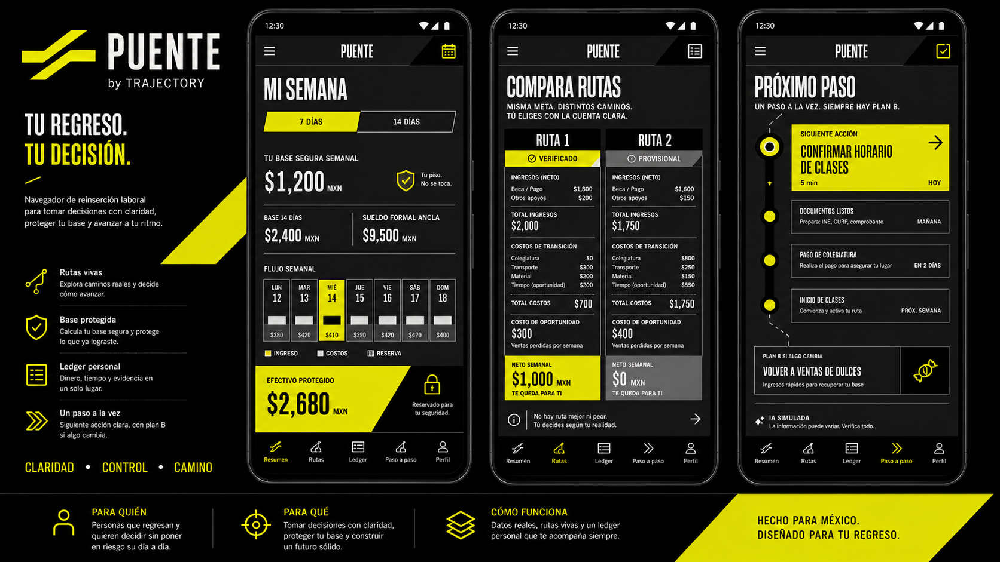
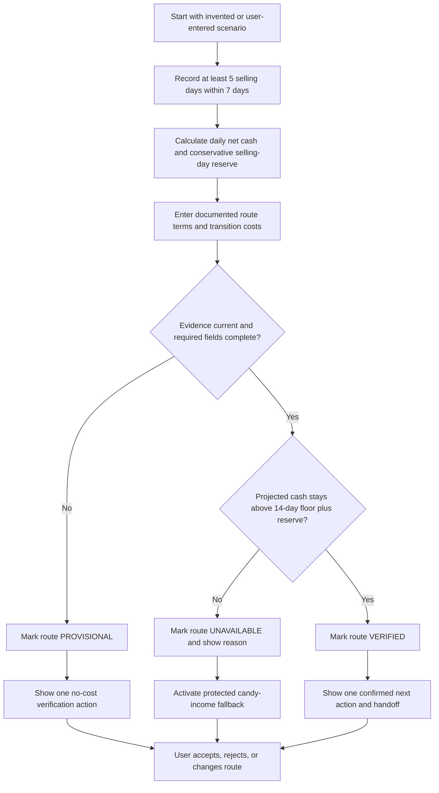
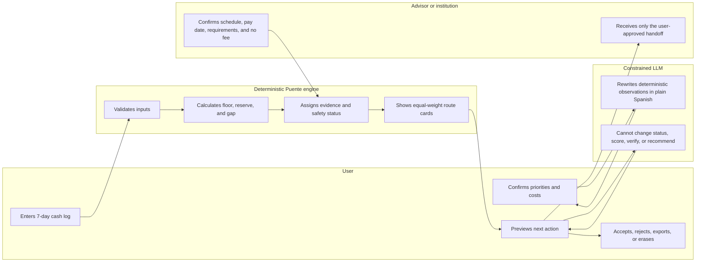

# PUENTE - Business Bending Week 4 Product Packet

**Owner:** Rodrigo Pena de Leon  
**Team:** 6  
**Declared slice:** Puente's 7/14-day cash-protection logic, route cards, evidence states, and protected fallback for one exact re-entry user.  
**Blueprint condition owned:** Condition 4 - every route protects immediate stability by accounting for income timing, transport, equipment, schedule, first-payment dates, and an emergency reserve.

**Working prototype:** https://puente-reingreso-rodrigo.j6x567qt8g.chatgpt.site
**Build evidence:** sixteen deterministic and LLM-boundary tests pass; six Sites versions were published through the final compliance rebuild; the mechanical, persona, specification-audit, and LLM-boundary fixes are documented and retested.

## 1. Problem in my words

A person who earns money informally cannot judge a formal job only by its monthly salary. Moving into formal work can temporarily remove today's cash while adding transport, meals, documents, equipment, unpaid onboarding, and a wait until the first paycheck. Existing career tools usually recommend occupations or courses but do not answer the urgent question: **Can I take this route without leaving my household short of cash before it pays?**

Puente is a Spanish, mobile-first decision-and-safety layer. It converts seven days of informal-work cash flow and documented opportunity terms into an explainable route status, one next action, and a fallback. It does not predict potential, rank people, decide who deserves a job, or guarantee employment.

## 2. Exact user

The working persona is **Luis (invented for testing)**, age 20, from Ecatepec de Morelos, State of Mexico. He left high school before graduating to help his household and sells packaged candy on foot between his neighborhood and a nearby Mexibus station. He needs immediate income, uses a low-cost Android phone, and recently attempted to obtain an entry-level formal job after reading the employee guide and attending an interview.

The first hypothesis is that a fixed or rotating schedule and the two-week wait for the first paycheck may conflict with the candy-selling windows that currently fund his household. An incomplete high-school credential is recorded only as a route requirement when an employer or provider documents it; it is not treated as evidence of low ability or an "unstable" personality.

## 3. Success definition

**Before the Week 4 module closes, a user can enter a validated seven-day candy-sales record, compare one formal-employment route and one advancement route, and receive an explainable verified, provisional, or unavailable status without any recommended route reducing projected cash below the protected 14-day floor plus one conservative selling-day reserve.**

The working safety values for the synthetic scenario are:

- Weekly net-cash floor: MXN 1,200.
- Fourteen-day floor before a biweekly paycheck: MXN 2,400.
- Emergency reserve: the lowest net selling day in the seven-day record.
- Verification budget: conservative projected 14-day net cash minus the floor and reserve; if zero or negative, only no-cost verification is allowed.
- Transition costs: transport, phone/data, lost candy income, documents/photos, uniform or shoes, meals, onboarding, bank fees, and unpaid training.

## 4. Image-generated mockup

The final direction below was generated before the implementation. It combines Option B's transparent survival ledger with Option A's living-route navigation. The visual identity uses only matte black, neutral grays, warm ivory, and acid yellow; it gives verified and provisional routes equal visual weight while making cash protection and the next action immediately legible.

**Brand decision:** `PUENTE` is the user-facing module name and `by TRAJECTORY` is the quiet system endorsement. The original two-span mark reads as both a bridge and a continuing route. The interface implements the geometry in CSS and keeps calculations in testable controls rather than treating the generated board as a pixel-perfect contract.

## 5. Feature flow

## 6. Actor swimlane

## 7. Benchmark line

**Best existing reference:** Singapore's MySkillsFuture Careers & Skills Passport organizes verified qualifications, skills, and employment information into visible pathways and recommendations.  
**Puente's localization:** it begins with irregular informal cash flow and Mexican re-entry constraints, uses user-entered evidence and manual institutional confirmation, protects the two-week income bridge, works in Spanish on a phone, and refuses to turn missing credentials into a destiny score.

## 8. Long view - three years

In three years, Puente could become a small, accountable network connecting state employment offices, trusted employers, education providers, and community organizations through maintained route data and confirmed handoffs. A person would carry a user-controlled re-entry record containing current constraints, evidence, route decisions, and completed steps without being assigned a permanent employability label. Expansion would occur state by state only when route accuracy, equal completion, staff-time reduction, safe cash outcomes, and value above full operating cost are demonstrated.

## 9. Scope cut - what this slice will not build

- No job marketplace, vacancy scraping, national opportunity database, or employer ranking.
- No real application submission, hiring decision, admission decision, payroll integration, or IMSS lookup.
- No destiny, employability, personality, poverty, or "best route" score.
- No real personal data, exact home address, CURP, NSS, ID scans, bank information, biometrics, or private employer messages.
- No database or authentication in this slice because the prototype does not persist personal information; reload clears the session.
- No AI scoring, verification, ranking, eligibility inference, route recommendation, or autonomous message sending. The production LLM is limited to rewriting validated deterministic observations in plain Spanish.
- No claim that the formal job, credential, or institutional handoff is available until its required evidence is confirmed.

**LLM boundary:** Brightspace explicitly requires **LLM + structured data**. Puente therefore uses a server-side GPT-5 mini endpoint, but only after the deterministic engine has calculated the result. The endpoint accepts a closed schema containing numbers, allowed route states, period, and user choice; it accepts no free text or personal fields. Its output cannot modify cash, evidence, status, selection, or next steps. A post-generation guard blocks scoring, aptitude, verification, approval, and recommendation language and falls back to deterministic text.

**Deployment status at audit:** the server-side endpoint and secret are deployed, but the provider currently returns `insufficient_quota`. This is represented honestly in the interface through the protected deterministic fallback. A successful generated rewrite remains pending either minimal provider credit or written confirmation from the professor that a simulated and labeled LLM slice is acceptable.

## 10. Product requirements

### P0 - must ship

1. **Seven-day cash log:** accept 5-7 daily records with gross sales, restocking, transport, other costs, hours, and computed net cash.
2. **Fourteen-day bridge:** project two weeks of conservative net cash and display the MXN 2,400 floor plus the lowest-day reserve.
3. **Transition-cost calculator:** include every cost category named in Blueprint Condition 4 and lost candy income.
4. **Evidence states:** every route visibly displays source, evidence date, and `VERIFIED`, `PROVISIONAL`, or `UNAVAILABLE`.
5. **Route cards:** show up to two equal-weight routes with requirements, schedule, first-payment date, costs, cash after transition, missing evidence, one next action, and responsible institution.
6. **Protected fallback:** if a route fails the cash floor or required evidence, preserve/restart the candy route for seven days and show one free parallel search action.
7. **Open-future controls:** allow the user to change priorities, reject every route, reset the session, and see why a route was excluded.
8. **Constrained LLM rewrite:** let the user request a clearly labeled plain-language rewrite of deterministic observations; LLM text cannot change route status or any structured field.
9. **Input safety:** validate types, ranges, maximum lengths, dates, and required fields; render no raw HTML from input.
10. **Responsive accessibility:** work at 360 px width, preserve readable contrast, use visible focus states, and support keyboard navigation.

### P1 - useful if time remains

- Export a user-approved summary as a local JSON or printable page without server storage.
- Toggle between seven-day baseline and fourteen-day projection explanations.
- Show an advisor-time budget indicator using the 30-minute pilot assumption.

### P2 - future consideration

- Real advisor workflow and institutional verification.
- Maintained partner-route database with evidence expiry and audit history.
- Optional authentication and Row Level Security when personal data persistence is introduced.
- Optional LLM-assisted intake only after field-level confirmation, consent, and stronger prompt-injection controls.

## 11. Acceptance criteria

- Given at least five valid selling days, when the user calculates the baseline, then daily net cash, weekly net cash, the lowest-day reserve, and projected 14-day cash appear.
- Given fewer than five valid days, when the user requests a result, then the product explains what is missing and does not assign a verified route.
- Given a route with current required evidence and projected cash at or above MXN 2,400 plus reserve, when calculated, then its status can be `VERIFIED` and the math is shown.
- Given missing or expired employer terms, when calculated, then the route is `PROVISIONAL` and one no-cost verification action is shown.
- Given projected cash below the protected amount, when calculated, then the route is `UNAVAILABLE`, the gap is shown, and the candy-income fallback activates.
- Given two routes, when displayed, then neither is called "best" and both receive equal visual weight.
- Given the user requests a plain-language rewrite, when the LLM responds, then it is labeled `LLM OUTPUT · GPT-5 MINI` and cannot alter the deterministic result.
- Given the LLM emits prohibited scoring, aptitude, verification, approval, or recommendation language, then the output is discarded and the deterministic summary remains visible.
- Given any text field longer than its limit or any negative/non-numeric money value, when submitted, then an inline validation message appears and no calculation runs.
- Given the user chooses reset, when confirmed, then all in-session entries disappear.

## 12. Architecture and free stack

| Layer | Choice | Why it is enough for this slice | Security implication |
|---|---|---|---|
| Interface | Vinext + React + TypeScript + semantic HTML + CSS | Fast, mobile-first, and deployable through OpenAI Sites | Inputs remain in local component state only |
| Structured data | Local typed JSON fixtures for routes and evidence | Demonstrates maintained data fields without pretending live integrations | Invented records only; explicit evidence dates |
| Decision core | Pure TypeScript functions | Deterministic, testable cash and status logic | AI cannot override safety or evidence rules |
| LLM rewrite | Server-side OpenAI Responses API using GPT-5 mini | Satisfies the LLM + structured-data floor with one bounded task | Key remains a hosted secret; no free text or personal fields are sent |
| Testing | Vitest + Playwright or DOM smoke tests | Covers calculations and core interaction | Includes invalid input and reset tests |
| Hosting | OpenAI Sites / Cloudflare-compatible ESM | Public prototype URL and server route | API key is stored only as a Sites secret |
| Persistence | None in V1 | Avoids storing personal data before auth/RLS exist | Refresh clears session; local export is user-triggered |

## 13. Security floor check

- **Secrets:** `OPENAI_API_KEY` exists only in the hosted environment; it never enters source, Git history, client JavaScript, or exported files.
- **Personal data:** invented persona and fixtures only; the UI warns users not to enter CURP, NSS, bank, ID, exact address, or real employer messages.
- **LLM data minimization:** the request contains only validated numeric observations, allowed route states, period, and route choice; `store: false` is set.
- **Authentication/RLS:** not applicable because no personal data is persisted. They become P0 before any personal-data storage exists.
- **Validation:** all fields have type, range, date, and length validation; outputs use text rendering rather than raw HTML.
- **External messages:** the user previews and copies a draft; Puente never sends it.

<!-- pagebreak -->

## 14. Test plan - two documented passes

### Mechanical pass

1. Run unit tests for daily net cash, lowest-day reserve, 14-day projection, transition costs, verification budget, and all three route statuses.
2. Run the synthetic safe scenario: current evidence, cash remains above floor plus reserve -> `VERIFIED`.
3. Run the stale-evidence scenario -> `PROVISIONAL` plus no-cost verification action.
4. Run the cash-breach scenario -> `UNAVAILABLE` plus protected fallback.
5. Run invalid inputs: fewer than five days, negative values, impossible dates, excessive text.
6. Test keyboard navigation and 360 px responsive layout.
7. Document at least one bug, fix it, commit, and redeploy.

### Persona pass

Open a fresh chat with the invented persona: "You are Luis, 20, from Ecatepec. You left high school to help at home, sell packaged candy near a Mexibus route, use a low-cost Android phone, read slowly, and distrust anything that looks like a debt or government scoring system. Attempt to decide whether you can accept a formal job without losing the cash your household needs. Narrate where you hesitate, what you do not understand, and where you would quit."

Walk the persona through screenshots in order. Log every confusion in `docs/PERSONA_LOG.md`, fix the worst confusion, and record before/after evidence.

## 15. Measurement and stop conditions

For this prototype, success is task completion and correct safety behavior, not employment placement. Record whether the synthetic user can identify the protected amount, understand each status, explain why a route failed, and identify the next action without assistance.

Stop or revise if the engine produces a preventable cash-floor breach, hides a missing requirement, labels an unconfirmed route verified, visually privileges one route, loses alternatives after changing priorities, or allows LLM output to change the decision core. At pilot scale, also stop for critical data errors, unequal completion, no handoff improvement, no staff-time reduction, or measured value below ten times full operating cost, as required by the Team 6 Blueprint.

## 16. Implementation prompt for the coding agent

Build a small mobile-first Vite + TypeScript web app named Puente from this packet. Implement the cash-protection engine as pure functions first, then the seven-day log, two equal-weight route cards, evidence statuses, and protected fallback. Add one server-side LLM endpoint that accepts only closed structured observations and rewrites them in plain Spanish; it must never score, verify, rank, infer eligibility, recommend a route, or modify structured state. Use only invented fixtures and no persistence. Add automated tests for route states, invalid inputs, the LLM schema, and prohibited language, then document the test-fix-redeploy cycle.

<!-- pagebreak -->

## 17. Commit and deployment plan

1. `docs: add Week 4 packet and generated mockup`
2. `feat: implement typed cash-protection engine and fixtures`
3. `feat: add mobile cash log and protected amount summary`
4. `feat: add route cards, evidence states, and fallback`
5. `test: cover safety states and input validation`
6. `fix: resolve worst mechanical or persona-test issue`
7. `docs: add persona log, decisions, and submission links`

Deploy 1 follows the first working route-card flow. Deploy 2 follows the documented bug fix and persona improvement.

## 18. Open questions

- **Non-blocking - data/partner:** which State of Mexico employment office and small partner set would maintain live route terms in a real pilot?
- **Non-blocking - operations:** can employer schedule and first-payment evidence be confirmed within the 30-minute advisor cap?
- **Blocking before real pilot - legal/security:** what consent, retention, accessibility, and public-sector procurement requirements apply once real participant data or institutional handoffs are introduced?

## 19. Final implementation audit - September 4, 2026

The first deployed interface did not fully match this Packet. It used weekly aggregate candy income, omitted the lowest-day reserve, collapsed transition costs into one number, and did not show complete route evidence metadata. The final compliance rebuild corrects those gaps:

- Seven editable daily records now capture sales, restocking, transport, other costs, and hours; fewer than five valid days blocks both routes.
- Daily net, weekly net, weekly hours, and the lowest positive net-day reserve are calculated visibly.
- Safety now protects the period floor plus that reserve.
- Transition costs expose transport, phone/data, documents, equipment or uniform, meals, bank/onboarding/unpaid training, and lost candy income as opportunity cost.
- Each route displays its simulated source, evidence date, requirements, schedule, first-payment/support treatment, missing evidence, and responsible party.
- The provisional education route counts MXN 0 of unconfirmed future income.
- The user can select, switch, reject all routes, reset after confirmation, and export a local JSON summary.
- A server-side GPT-5 mini endpoint now rewrites only validated deterministic observations, with `store: false`, no free text, no personal fields, and a prohibited-language fallback.
- Sixteen automated tests, a successful production build, lint, and a 360 px interaction pass validate the final source.
- The hosted secret is configured; the final live audit reached the provider but received `insufficient_quota`, so no successful generated output is claimed.
