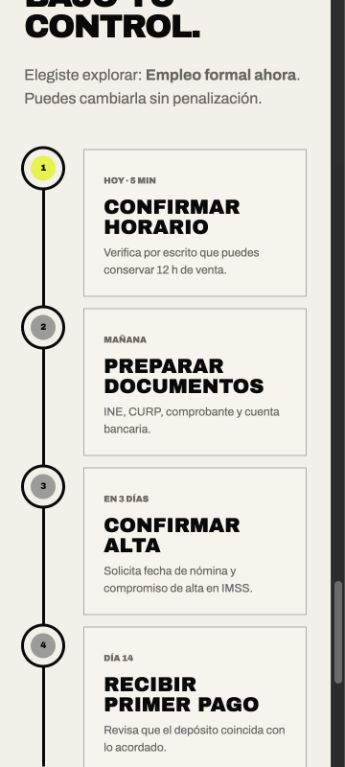
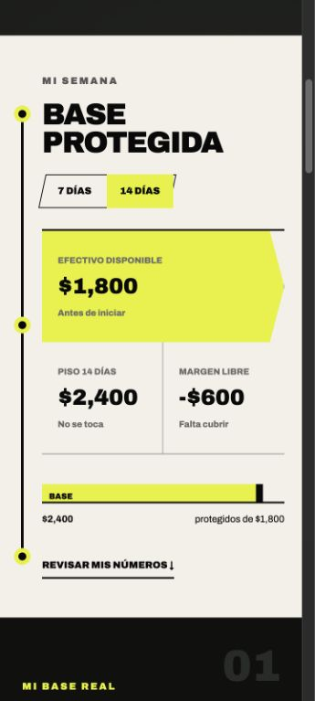
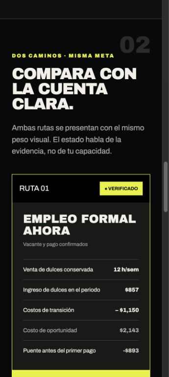
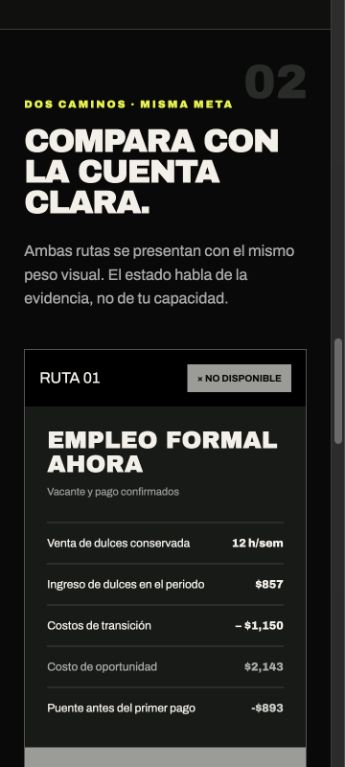
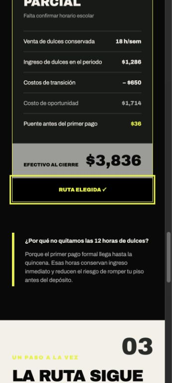
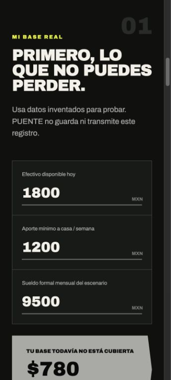
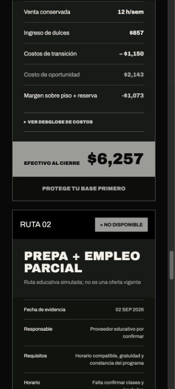
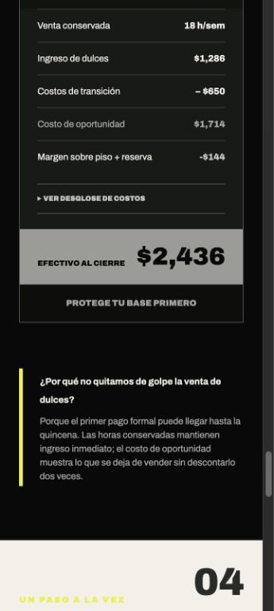
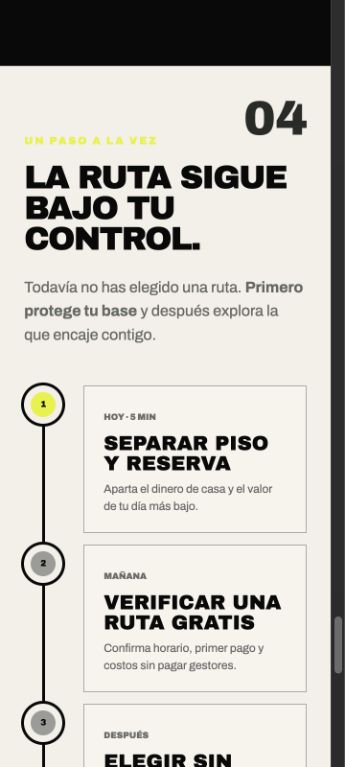

# PUENTE - Synthetic persona test

**Date:** September 2, 2026  
**Test type:** fresh mobile session, 360 x 800 px  
**Prototype:** PUENTE Week 4  
**Tester role:** synthetic persona, no real personal data

## Persona prompt

You are Luis, 20, from Ecatepec. You left high school to help at home, sell packaged candy near a Mexibus route, use a low-cost Android phone, read slowly, and distrust anything that looks like debt or government scoring. Attempt to decide whether you can accept a formal job without losing the cash your household needs. Narrate where you hesitate, what you do not understand, and where you would quit.

## Scenario entered

| Input | Synthetic value |
|---|---:|
| Cash available today | MXN 1,800 |
| Minimum household contribution | MXN 1,200/week |
| Net candy income | MXN 1,500/week |
| Candy-selling time | 42 hours/week |
| Expected formal salary | MXN 9,500/month |
| Decision window | 14 days |

## Walkthrough and narration

1. **Landing screen:** "I understand that this is about protecting the money for my house, not measuring whether I am a good worker. I would continue."
2. **Base result:** "It says I am MXN 600 short. That is clear, but I need to know whether this stops me from choosing a route."
3. **Formal route:** "The job says VERIFIED, but below it says I would be MXN 893 short before the first payment. The button also says ROUTE CHOSEN. I do not know which message to trust."
4. **Education route:** "This one is provisional but keeps more selling hours and the bridge is positive. I would compare it, although I need the word provisional explained."
5. **Exit point:** The persona would quit at the first route card because the verified badge and selected state appear to overrule the negative bridge.

## Confusion log

| Priority | Confusion | Risk | Resolution |
|---|---|---|---|
| Critical | A route remained `VERIFIED` and preselected while its pre-paycheck bridge was negative. | Could encourage an unsafe transition and violate Blueprint Condition 4. | If `bridge < 0`, display `NO DISPONIBLE`, disable route selection, and direct the user to protect the base first. |
| High | Route 1 was selected before the user made a choice. | Visually privileges one route and weakens the Open-Future firewall. | Start with no route selected; keep both actions equivalent. |
| Medium | `PROVISIONAL` may sound like a judgment of the person. | The user may interpret missing evidence as low ability. | Keep the copy: "The state speaks about evidence, not your ability." Future test should try `FALTA CONFIRMAR`. |
| Low | Opportunity cost is numerically clear but still unfamiliar language. | Slow readers may skip it. | Retain the explanation about the 12 candy-selling hours and test a plain-language label later. |

## Before evidence

## Worst issue selected

The critical contradiction between `VERIFIED` and a negative cash bridge was selected because it could change behavior and cause a preventable household cash-floor breach. This is not a copy preference; it is a safety failure.

## Fix acceptance criteria

- A negative pre-paycheck bridge produces `NO DISPONIBLE` regardless of evidence status.
- An unavailable route cannot be selected.
- No route is selected on first load.
- The next-step area instructs the user to protect the base until they actively choose a safe route.
- The same synthetic values leave Route 1 unavailable and Route 2 provisional/available.

<!-- pagebreak -->

## After evidence

## Retest result

With the same values, Route 1 now displays `NO DISPONIBLE`, its action is disabled, and no route is chosen automatically. Route 2 remains `PROVISIONAL` because its school schedule is unconfirmed, but its positive MXN 36 bridge allows the persona to explore it. Selecting Route 2 updates the next-step sequence to validate the school schedule, confirm that the option is free, preserve 18 selling hours, and review the route on day 14.

The critical acceptance criteria pass. The remaining medium-priority wording test for `PROVISIONAL` is recorded for a future iteration rather than expanded into this Week 4 slice.

## Final compliance retest - September 4, 2026

The specification audit found that the earlier persona test still omitted the Blueprint's emergency reserve because the product accepted only weekly aggregate income. The final retest uses the same Luis profile with a complete seven-day record:

| Input | Final synthetic value |
|---|---:|
| Cash available today | MXN 1,800 |
| Household floor | MXN 1,200/week |
| Seven-day candy net | MXN 1,500 |
| Selling time | 42 hours/week |
| Lowest positive net day | MXN 180 |
| Protected 14-day amount | MXN 2,580 |
| Formal salary scenario | MXN 9,500/month |

The formal route retains 12 selling hours but ends MXN 1,073 below the floor plus reserve before payday. The education route retains 18 hours and counts no unconfirmed support, but it remains MXN 144 below the protected amount. Both routes correctly become `NO DISPONIBLE`; neither can be selected. The fallback tells Luis to separate the floor and reserve, verify one route for free, and preserve seven days of candy sales. This is safer than forcing the previous MXN 36 provisional route to appear feasible without a reserve.

